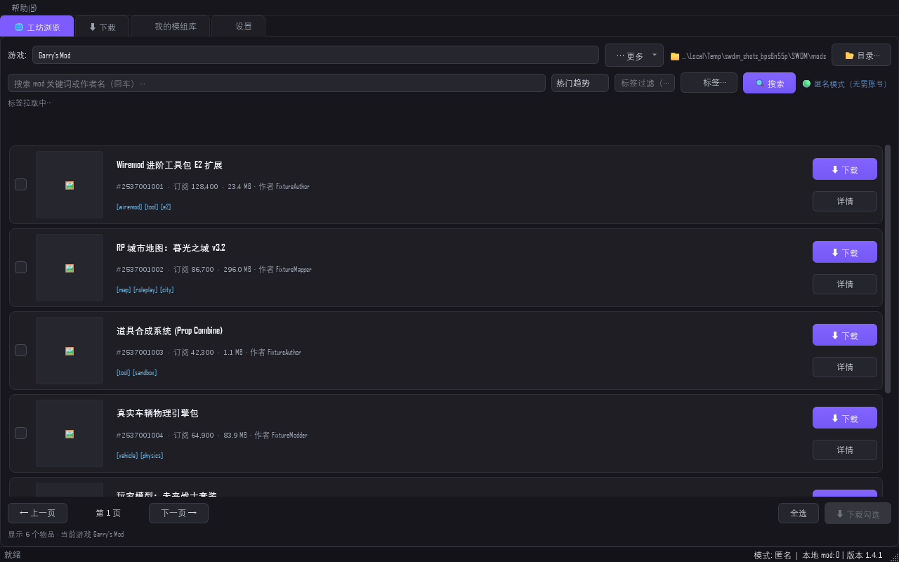
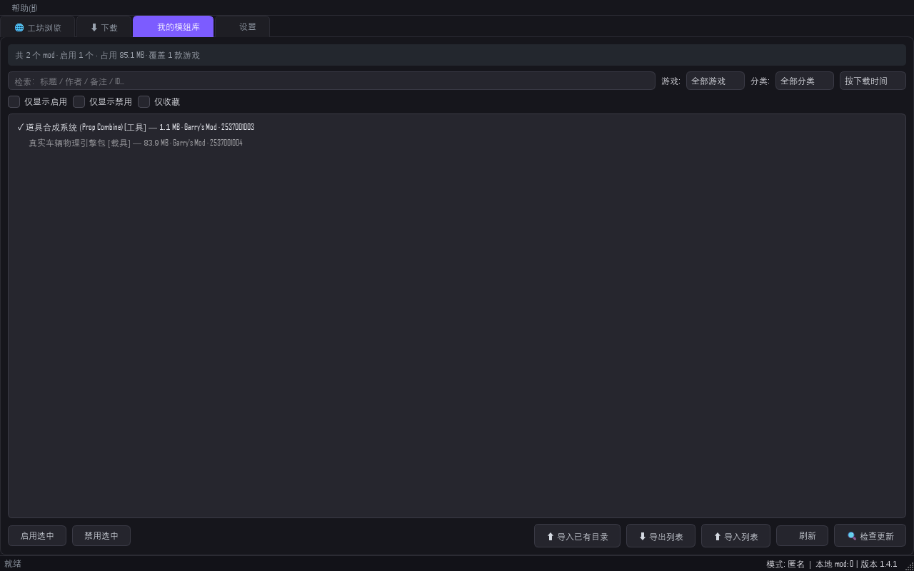

# Demo 说明 · Steam 工坊下载管理器（SWDM)1.4.2

> $\text{Steam Workshop Download Manager}$ · 版本 **1.4.2** · Windows 桌面程序
> 无需 Steam 账号，匿名浏览、下载与管理创意工坊 mod

## 一、创意与定位

一套面向玩家的 Steam 创意工坊桌面客户端：**浏览 / 搜索工坊 → 免账号匿名下载 → 本地分游戏管理**，对标 Steam 客户端的工坊体验，并补足官方客户端缺失的本地管理能力（分类、启用/禁用、导入导出）。

本工程经历了完整的工程化演进：从 1.0 的单文件脚本，逐迭代重构至 1.4.2 的多模块架构；并在 1.4.2 同期完成了 2.0(C# WPF）重写的架构契约、可行性矩阵与视觉语言研究。本 Demo 提交的是**已交付并经两轮复测的 1.4.2 稳定版**。

## 二、核心功能一览

| 需求 | 实现 |
|---|---|
| ① 指定游戏拉取工坊列表，分类 / 搜索 / 热度排名 | 游戏选择器（可收藏 / 自定义 AppID)→ `storesearch` + 工坊页抓取 + `GetPublishedFileDetails` 批量补全；关键词搜索、标签过滤、6 种排序（趋势 / 最新 / 订阅 / 评分 / 浏览 / 收藏），元数据补全后客户端重排保证"热度排名"准确 |
| ② 免账号匿名下载 | steamcmd 匿名通道（Valve 官方工具）为主；账号通道与私人 mod 通道为备（可登录） |
| ③ 下载进度、队列、续传 | 每任务独立线程；队列入队即占位行 + 即时反馈；暂停 / 全部暂停 / 重试失败 / 取消后行内重试；失败原因枚举与原因直显 |
| ④ 本地模组库分游戏管理 | 已安装 mod 扫描入册；分类树 + 卡片视图；勾选导入导出；启用 / 禁用；库页更新检查 |
| ⑤ 界面好看 | 设计令牌系统 v1.0(light/dark 双主题），PCL2 风格卡片、圆角与悬停动效 |

## 三、界面导览

程序为**五标签页**结构（工坊浏览 / 下载 / 我的模组库 / 设置 / 调试），托盘图标常驻，关窗默认最小化到托盘。

### 1. 工坊浏览页

输入游戏名即出联想（中英文均可，如「饥荒」↔「Don't Starve」),回车进入该游戏工坊；支持关键词、标签、排序与分页；卡片悬停预览图片与统计。

**搜索联想（1.4.2 重点修复）**：QCompleter 原地更新模型，输入途中不重建弹窗；中文输入法连按 Backspace 逐字删除；每一样操作 150ms 内状态栏给出反馈。

### 2. 下载队列页

入队即占位；速度、进度、分段状态实时刷新；暂停 / 继续 / 取消 / 行内重试全部可达。

**队列语义（1.4.2 修复）**：取消后行内重试不再被旧任务收尾吞掉（对象同一性判定）；暂停期间排队任务不被派发（派发前复查暂停态）。

### 3. 我的模组库

本地已安装 mod 按游戏与自定义分类组织，支持导入导出与启用 / 禁用。

### 4. 设置页

账号、网络（代理）、下载通道、目录、外观（modern/classic 双主题）。

## 四、使用方式

### 环境要求
Windows 10/11 x64。

### 获取与安装

- GitHub Release:`https://github.com/aqua-skies/Steam-Workshop-Download-Manager/releases`
- 下载 `SWDM-Setup-1.4.2.exe`(46.1 MB),按向导安装（数据默认存于 `%APPDATA%\SWDM`)
- 开始菜单启动 **SWDM**
- 若杀毒软件拦截 steamcmd 相关进程，请放行——steamcmd 是 Valve 官方命令行工具，程序用它执行下载

### 5 步下到第一个 mod（无需账号）

1. 启动程序
2. 在工坊页输入游戏名（如「饥荒」或「Don't Starve」），回车
3. 浏览 / 搜索 / 筛选列表，点击卡片查看详情
4. 在详情或列表点「下载」，下载页出现占位行并开始
5. 完成后在「我的模组库」看到该 mod

### 其他

- 关闭主窗口=最小化到托盘；退出请走托盘菜单「退出」
- 下载绝大多数工坊物品无需账号；私密 / 需_age 物品可在设置页登录账号通道
- 每次迭代的完整变更记录见仓库 `legacy/docs/changelog_*.md`

## 五、版本快照

| 版本线 | 内容 |
|---|---|
| 1.0 → 1.4.2 | 工坊浏览、匿名下载、队列管理、本地模组库、设计令牌双主题、三处崩溃类根因修复、五个交互 bug 根因修复（真实按键模拟 17/17)|
| **1.4.2（本 Demo)** | 已交付：安装包 46.1MB + tag v1.4.2;两轮复测全绿 + 讨论组评审通过 |
| 2.0（进行中） | C# WPF 重构，PCL2 级界面与 IDM 级下载体验；架构 / 视觉 / 测试三规格与六阶段路线已定，0.7.0 开发中 |

## 六、源码与文档

GitHub 仓库：`https://github.com/aqua-skies/Steam-Workshop-Download-Manager`

- `swdm/`(1.4.2 全部源码与打包配置，现归档于 `legacy/` 目录）
- `legacy/docs/manual/SWDM用户手册.md`:432 行完整用户手册
- `legacy/docs/architecture/`:18 模块系统契约、下载状态转移图、四路线可行性矩阵
- `legacy/docs/design/`:视觉语言研究与设计令牌定义
- `swdm2/`:2.0 重构源码（进行中）
- `LICENSE`:MIT

---

*本 Demo 说明由 Atria-Dawn-Preview 模型整理，对应 SWDM 1.4.2(2026-10-02 交付）。*
