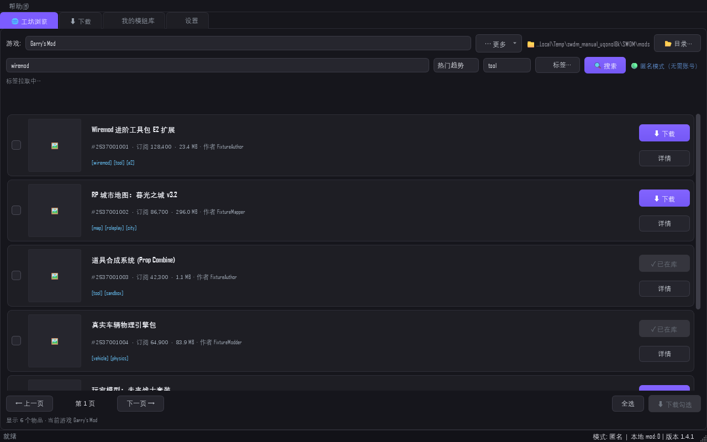
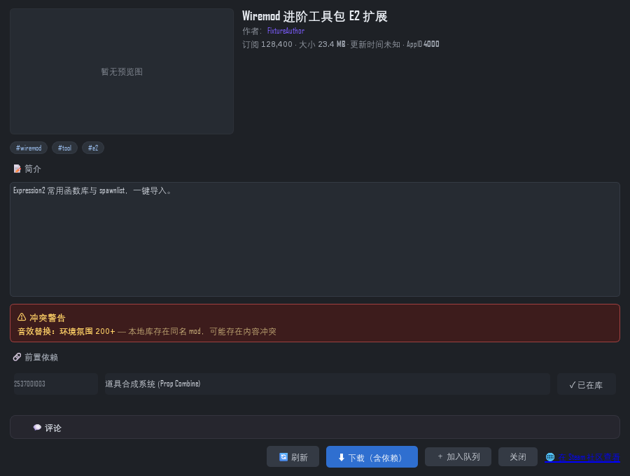
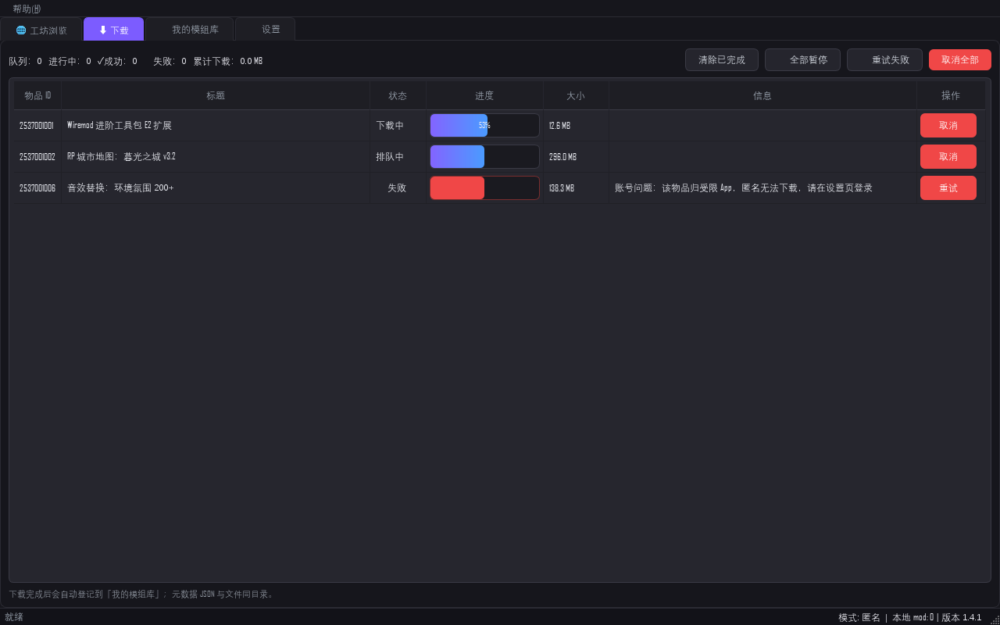
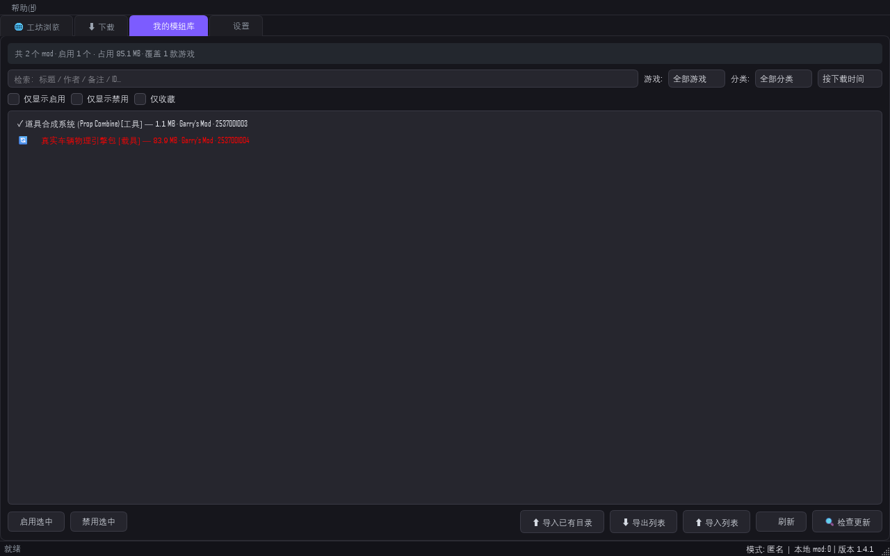
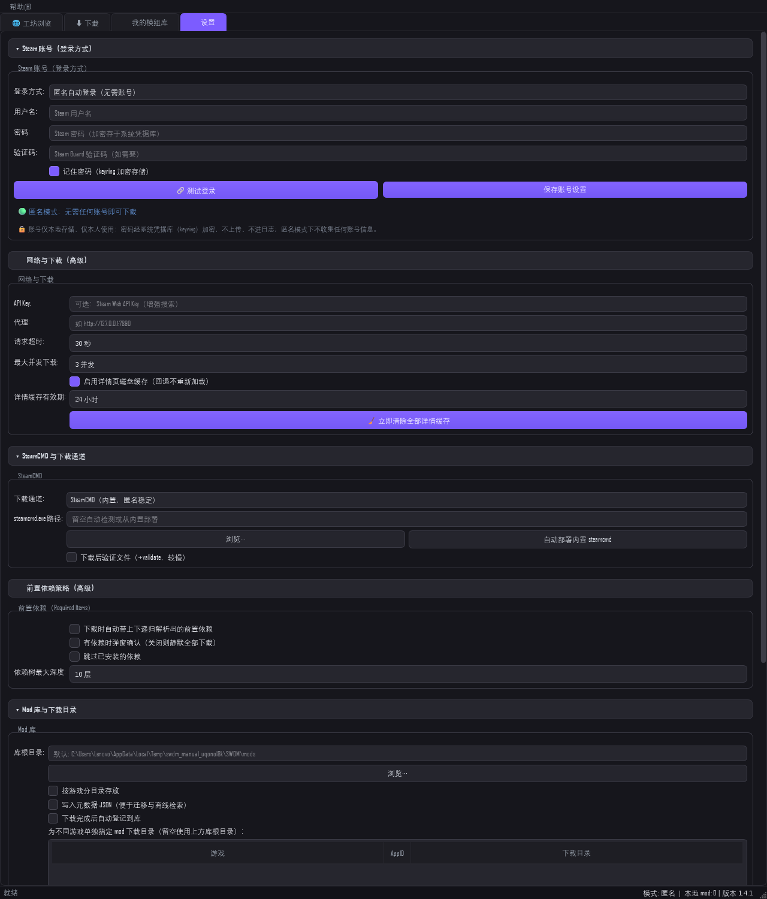

# SWDM 用户手册

**Steam 工坊下载管理器（SWDM）· 版本 1.4.2**

- 手册版本：随程序版本 **1.4.2** 发布，界面与行为以 1.4.2 代码冻结时点（2026-10-02）的实测状态为准
- 适用读者：第一次使用 SWDM 的普通玩家；无需任何编程或 SteamCMD 知识
- 配套文档：每次迭代的完整变更记录见 [`../changelog_1.4.1.md`](../changelog_1.4.1.md)（历史版本同目录 `changelog_1.3.x.md` / `changelog_1.4.0.md`）
- 开源许可：MIT License（见仓库根目录 `LICENSE`，Copyright © 2026 aqua-skies）
- 反馈渠道：GitHub Issues — `https://github.com/aqua-skies/Steam-Workshop-Download-Manager/issues`

> 本手册的约定：**「加粗」表示界面上的按钮或菜单文字**；操作步骤统一编号；截图均由固定示例数据离线渲染，与你本地的实际列表无关。

---

## 目录

0. [扉页与版本声明](#0-扉页与版本声明)
1. [快速上手：5 步下到第一个 mod](#1-快速上手5-步下到第一个-mod)
2. [核心概念](#2-核心概念)
3. [工坊浏览页](#3-工坊浏览页)
4. [下载队列页](#4-下载队列页)
5. [我的模组库页](#5-我的模组库页)
6. [设置页](#6-设置页)
7. [调试页](#7-调试页)
8. [故障排查与 FAQ](#8-故障排查与-faq)
9. [帮我们改进](#9-帮我们改进)

---

## 0. 扉页与版本声明

SWDM 是一个 Windows 桌面程序（Python 3.12 + PySide6），用来从 Steam 创意工坊（Workshop）浏览和下载 mod，并在本地分游戏管理。

**版本绑定声明**：本手册描述的全部界面与行为，均对应 **SWDM 1.4.1**。程序主界面标题栏显示 `Steam 工坊下载管理器 v1.4.1`；如果你的标题栏版本号与本手册不一致，请到仓库 Releases 页面下载对应版本的手册，或以程序实际行为为准。1.4.1 相对 1.4.0 的差异（详情页磁盘缓存、预取加速、剪贴板入队、界面美化、库更新检查、私人账号通道、失败原因枚举等）逐条列在 [`../changelog_1.4.1.md`](../changelog_1.4.1.md)。

**程序主界面结构**（五个标签页，从左到右）：

| 标签 | 名称 | 作用 |
|---|---|---|
| 🌐 | 工坊浏览 | 搜索、筛选、浏览工坊物品 |
| ⬇ | 下载 | 下载队列、进度与失败处理 |
| 🗂 | 我的模组库 | 本地 mod 的分类、启用/禁用、导入导出 |
| ⚙ | 设置 | 账号、网络、下载通道、目录、外观 |
| 🐛 | 调试 | 日志查看（**默认隐藏**，见第 7 章） |

首次启动时，托盘图标与系统托盘菜单（「显示主窗口」/「退出」）同时可用；**单击或双击托盘图标恢复窗口**；关闭主窗口默认最小化到托盘（右下角弹出提示「已最小化到托盘，双击图标恢复窗口。」），而不是退出程序——真正的退出走托盘菜单的「退出」；卸载程序发出的关闭请求会被识别为真退出（不会残留进程）。

---

## 1. 快速上手：5 步下到第一个 mod

以「给 Garry's Mod 下载一个工坊物品」为例。**整个过程不需要 Steam 账号**（匿名即可下载绝大多数工坊物品）。

**第 1 步：安装并启动**

1. 运行安装程序 `SWDM-Setup-1.4.1.exe`，按向导完成安装（数据默认存放在 `%APPDATA%\SWDM`，可在安装时 查看/修改）。
2. 从开始菜单启动 **SWDM**。标题栏应显示 `Steam 工坊下载管理器 v1.4.1`。
3. 如果杀毒软件拦截 steamcmd 相关进程，请放行——steamcmd 是 Valve 官方命令行工具，SWDM 用它执行下载。

**第 2 步：选择游戏**

1. 在「🌐 工坊浏览」页左上角的游戏下拉框中选择游戏（例如 *Garry's Mod*）。
2. 下拉框带模糊搜索：也可以直接输入游戏名或 AppID（数字）来筛选。
3. 下拉框第一项「★ 收藏」用于快速回到已收藏的游戏；点击列表上方工具栏的 **⋯ 更多** → **☆ 收藏游戏** 可收藏当前游戏。

**第 3 步：搜索或浏览物品**

1. 在搜索框（占位文字「搜索 mod 关键词或作者名（回车）…」）输入关键词，**按回车**。
2. 列表默认按「热门趋势」排序；右上角排序下拉可切到「最新发布 / 最多订阅 / 评价最高 / 最多浏览 / 最多收藏」。
3. 找到目标物品后，点击卡片上的 **详情** 查看简介、依赖和评论；或直接点 **⬇ 下载**。

**第 4 步：下载**

1. 点击 **⬇ 下载** 后，程序自动切到「⬇ 下载」页（下载队列页），该物品出现在队列中。
2. 如果该物品带前置依赖，且设置里「有依赖时弹窗确认」开启，会弹出确认窗——同意后依赖会被一并加入队列。
3. 如果提示「steamcmd 未就绪」，到「⚙ 设置」→ **SteamCMD 与下载通道** 分组点 **自动部署内置 steamcmd**（安装包已自带文件，无需联网），再重试下载。

**第 5 步：在游戏里找到它**

1. 下载成功后，文件进入你的 mod 库目录（默认 `%APPDATA%\SWDM\steamapps\workshop\content\<AppID>\<物品ID>`，按游戏分目录存放）。
2. 在「🗂 我的模组库」页可以检索、启用/禁用、分类、给文件加备注。
3. 带 mod 管理系统的游戏（如 GMod 的 `addons` 文件夹）可能需要额外把文件复制进游戏目录，或借助第三方加载器——SWDM 只负责下载与本地管理，不替你做游戏侧的加载配置。

完成。下面几章逐一解释每个界面的完整功能与可调项。

---

## 2. 核心概念

理解这六个概念，后面的所有操作都会一目了然。

### 2.1 AppID 与 publishedfileid（物品 ID）

- **AppID**：游戏在 Steam 上的唯一编号（如 Garry's Mod = 4000）。SWDM 的游戏下拉框里每个游戏都对应一个 AppID。
- **publishedfileid（物品 ID）**：工坊物品的唯一编号，是一串纯数字（如 2537001001）。工坊物品网址 `https://steamcommunity.com/sharedfiles/filedetails/?id=2537001001` 里 `id=` 后面的那串数字就是它。

下载、入队、导入时提到的「物品 ID」都指这串数字。**B3 剪贴板功能**就是靠识别它来工作的：你在任何地方复制了一个工坊物品链接或纯 ID，SWDM 会自动把它加入下载队列。

### 2.2 下载通道（provider 链）与自动回退

SWDM 不只有一个下载通道。「⚙ 设置」→ **SteamCMD 与下载通道** 里的「下载通道」下拉按 provider 注册表动态生成，匿名状态下内置三个通道（手动登录账号后还会额外出现私人账号通道，见 2.3）：

| 通道 | 说明 |
|---|---|
| **SteamCMD（内置，匿名稳定）** | 永远的兜底通道，匿名可用 |
| **GGNetwork 代理（匿名加速，实验性）** | 第三方加速通道，匿名可用，1.4.1 起经实网补测确认可用 |
| **CDN 直链（HTTP 高速，需登录）** | 最快，但 Steam 不对匿名会话开放 |

「下载通道」下拉后的可用性标注含义：**（⚠ 当前不可用）** 表示探测失败但仍可强制选用；**（未配置，链内自动跳过）** 表示缺少必要凭据；**（已禁用）** 表示该通道被手动关闭。如果所选通道在下载时失败，程序会**沿链自动回退到下一个可用通道，直到 SteamCMD 兜底**——回退不会消耗你的自动重试次数。把鼠标悬停在「下载通道」上可以看到这段说明。

### 2.3 匿名访问与私人账号

默认 **匿名模式**：不需要登录任何账号即可浏览和下载绝大多数工坊物品。少数物品归属「受限 App」（年龄验证 / 私有 / 付费游戏内容），匿名下载会在列表里返回 0 条或下载失败。1.4.1 起新增 **SteamCMD（私人账号·自己有权内容）** 通道：在「⚙ 设置」→ **Steam 账号（登录方式）** 切到「手动登录（用户名密码）」并填凭据后，该通道出现，用来下载**你自己账号有权访问**的内容。

账号安全设计（你可以放心使用）：

- 密码经系统凭据库（keyring）加密存储，**不上传任何服务器、不写入日志、不进入导出包**；
- 匿名模式下不收集任何账号信息；
- 账号通道与默认下载链**相互独立**——默认链恒为匿名，账号出问题不会阻塞你的普通下载；
- 首次在新机器登录需要 Steam Guard 验证码，验证成功后本机缓存凭证，之后免验证码。

### 2.4 Mod 包（依赖）

很多 mod 依赖其他 mod 才能正常工作（工坊页面上的 *Required Items*）。SWDM 会递归解析依赖树并（默认）自动把依赖一起下载。相关设置在「⚙ 设置」→ **前置依赖（Required Items）** 分组：是否自动下载、是否弹窗确认、是否跳过已安装的依赖、依赖树最大深度（1–20 层）。详情弹窗里也能看到当前物品的依赖清单。

### 2.5 冲突

两种情况会被标记为冲突：

1. **本地库冲突**：下载的物品与库里已有的某个 mod 同名或同 ID，重复下载会覆盖现有版本——在工坊页点 **⬇ 下载** 时会被拦截并提示原因。
2. **作者声明的冲突**：详情页正文里作者写明了与哪些 mod 冲突——详情弹窗的「冲突」小节会列出来。

冲突只是**提示**，不会阻止你下载，判断权在你。

### 2.6 数据目录

配置、mod 库、日志、缓存统一存放在数据目录（默认 `%APPDATA%\SWDM`）。**⚙ 设置**→ **Mod 库与下载目录** 分组的 **📁 打开数据目录** 一键在文件管理器里打开它。在程序所在目录放入 `portable.marker` 空文件可切换为便携模式（数据存到程序目录下的 `data` 文件夹）。

---

## 3. 工坊浏览页

### 3.1 找到你想下的东西：搜索 / 标签 / 排序

1. **选游戏**：左上角游戏下拉框（可输入过滤；「★ 收藏」置顶收藏的游戏）。
2. **搜索**：搜索框输入关键词或作者名，**按回车**生效（提示文字里写了「回车」）；也可以直接点旁边的 **🔍 搜索** 按钮。搜索带冷却机制：连续快速搜索时程序会自动合并并稍后重发，不会刷爆 Steam 的限流。
3. **标签过滤**：搜索栏下方是一排**标签 chip**（选好游戏后自动拉取该游戏的可用标签，chip 上显示热度计数，单击可多选、已选项带 ✕ 可再点取消）。另外，标签输入框支持逗号分隔多标签（如 `tool, sandbox`）作为精确过滤；**🏷 标签…** 按钮的作用是**强制重新拉取标签**（清缓存后刷新，标签拉取失败时有用），不是弹出选择列表。
4. **排序**：右上角下拉六选一——热门趋势 / 最新发布 / 最多订阅 / 评价最高 / 最多浏览 / 最多收藏。切换排序会立刻刷新列表。
5. **翻页**：底部 **← 上一页** / **下一页 →**。翻到下一页时，程序会**后台预取再下一页**（B2 加速，预取失败你也不会感知到）。

页面右上角还有登录状态标识：**🟢 匿名**（默认，无需账号）或 **🔵 已登录：<用户名>**（设置页切到手动登录后显示，见 2.3）。

### 3.2 批量操作

- 勾选多张卡片左上角的勾选框（或底部 **全选**），点 **⬇ 下载勾选** 一次性入队。
- **⋯ 更多** 菜单：
  - **☆ 收藏游戏**：把当前游戏加入收藏，置顶下拉框；
  - **＋ 添加自定义游戏…**：工坊列表里没有的游戏，手动输入 AppID 添加；
  - **🔗 批量粘贴导入…**（B5）：把一**堆**工坊物品链接或物品 ID 粘进对话框，一次全部加入下载队列。
- **📂 目录…**：直接修改当前游戏的 mod 下载目录（等效于设置页的「游戏专属下载目录」）。

### 3.3 剪贴板自动入队（B3）

设置里「监听剪贴板」默认**开启**。只要它开着：

1. 在浏览器、聊天软件或任何地方**复制**一个工坊物品链接（`steamcommunity.com/sharedfiles/filedetails/?id=…`）或纯物品 ID；
2. SWDM 自动解析并加入下载队列，无需切回程序点任何按钮。

程序只在内容匹配工坊链接/ID 格式时解析，不会记录或缓存你的剪贴板历史。到下载页可以看到新入队的物品。不想要这个行为？第 6.4 节教你怎么关。

### 3.4 卡片上的按钮

- **详情**：打开详情弹窗（依赖 / 冲突 / 评论 / 预览图 / 下载按钮）；
- **⬇ 下载**：直接加入下载队列（有冲突会被拦截并给出原因）。

详情弹窗（下图）把该物品的完整信息聚在一个窗口里：

- 顶部预览图与标题、作者（**点击作者名可搜索该作者的其他 mod**）；
- 标题旁有一排**标签 chip**，点击任一 chip 即按该标签筛选工坊列表；
- **简介**区：作者写的描述原文（简介里的链接可直接点击打开）；
- **前置依赖**：逐条列出依赖物品（已安装的会标记）；**点击依赖行标题可搜索该依赖**，每行右侧还有**独立下载按钮**，不必回到列表；
- **冲突**：作者声明的冲突物品与原因；
- **评论**：工坊最新评论（量较大**默认折叠**，标题显示「💬 评论（N）」，点击展开）；
- 底部按钮：**🔄 刷新**（忽略缓存，强制从 Steam 重新拉取）、**⬇ 下载（含依赖）**、**＋ 加入队列**（排入下载队列、随队列自动开始）、**🌐 在 Steam 社区查看**（用浏览器打开该物品的官方页面）、**关闭**；若物品已在库则下载按钮显示 **✓ 已在库**。

### 3.5 空结果怎么办

搜索词没有任何命中时，工坊页**只在底部状态栏显示一行小字提示**（如「未找到匹配的 mod」），没有中央空态与引导按钮——中央空态引导目前只在下载页（空队列）和库页（空库/筛选空）才有。计划在 1.4.2 为工坊页空结果补中央空态与「前往浏览/清除筛选」引导。如果搜的是作者名而命中 0 条，多半是 Steam 的搜索本身只匹配标题——换个关键词、或改用标签过滤、或在详情页点作者名查其作品列表。

---

## 4. 下载队列页

### 4.1 队列总览

- 顶部状态条实时刷新：「队列：N  进行中：N  ✓成功：N  ✗失败：N  累计下载：X MB」，队列暂停时末尾追加「⏸ 已暂停」标记。
- 表格七列：**物品 ID / 标题 / 状态 / 进度 / 大小 / 信息 / 操作**。
- 状态文案：排队中 / 下载中 / ✓ 成功 / ✗ 失败 / 已取消。
- **进度条颜色**（1.4.1 界面美化）：成功为绿色、失败为红色、进行中为蓝色渐变。
- steamcmd 通道不输出逐字节进度——此时进度条显示**忙碌动画**而不是假装卡在 0%。看到它转不代表死机。

### 4.2 四个批量按钮

- **⏸ 全部暂停 / ▶ 全部继续**：同一个按钮，按队列状态自动切换文案与行为（1.3.9 起合并为单按钮）。
- **↻ 重试失败**：把所有失败行重新入队。
- **取消全部**：清空未完成的任务（红色危险按钮，已完成的不会被清）。
- **清除已完成**：把**所有已结束的行**（✓ 成功、✗ 失败、已取消三类终态行）一起移出列表（**文件不会删**，成功下载的仍在库里）。失败行也被移除——如果你还想重试失败任务，请先点 **↻ 重试失败** 再清除；计划在 1.4.2 改为只清除成功行，让失败行留在列表里便于处理（与按钮名一致）。

### 4.3 单行操作

每行最右的操作列，按行状态自动变化：

- 进行中/排队中：**取消**（取消胜出于竞态窗口，已入库的文件不会被回滚成失败）；
- 失败/已取消：**重试**（不必回工坊页重新找卡片）；
- 成功：**移除**（仅移除行，文件保留）。

**失败原因枚举（C2，1.4.1 新增）**：失败行的「信息」列会给出可读的归因，而不是一串看不懂的英文日志。一共八类（文案为程序实际输出，以代码 `failure_reason.render_failure` 为准）：

| 信息列文案 | 含义与处理 |
|---|---|
| 磁盘空间不足，请清理后重试。 | 清理磁盘后点 **重试** |
| 下载内容为空 | steamcmd 假成功（报 SUCCESS 但 0 字节）被程序识破，多为网络中断，直接重试 |
| 触发 Steam 限流，请稍后重试。 | 程序已自动冷却退避，稍后重试即可 |
| 网络超时或无法连接 Steam 服务器，请检查网络后重试。 | 检查网络/代理；本机走代理时可填设置页「代理」 |
| 登录失败（可能是账号/密码错误，或触发 Steam Guard） | 凭据问题（不是所有权问题），到设置页 **🔗 测试登录** |
| 物品不存在或已从 Steam 工坊下架。 | 换源或放弃 |
| 该游戏可能需要正版 Steam 账号才能下载（受限应用）。可在「设置 → 账号」登录… | 受限 App/私密内容，见 2.3 节登录私人账号通道 |
| 下载失败：steamcmd 未区分权限/网络/限流等原因，建议重试。详见日志。 | 兜底分类，不误导你乱改设置；重试或查调试页日志 |

> 归因只影响文案，不改变重试逻辑。程序内部另有熔断器：连续多次失败会自动冷却 15 秒，避免对已经不通的网络空打请求。

### 4.4 下载完成后

- 自动登记到「我的模组库」（可在设置页关闭自动登记）；
- 元数据以 JSON 写在与文件同目录（便于迁移与离线检索，可在设置页关闭）；
- 系统托盘弹出「下载完成」通知；
- 如果队列空了，页面中央出现空态引导 **前往工坊浏览**。

---

## 5. 我的模组库页

### 5.1 检索与筛选

- 搜索框「检索：标题 / 作者 / 备注 / ID…」支持四个字段模糊匹配；
- 排序下拉：按下载时间 / 按标题 / 按大小 / 按订阅数 / 按游戏；
- 勾选过滤：**仅显示启用** / **仅显示禁用** / **仅收藏**；
- 游戏下拉「全部游戏」+ 分类下拉「全部分类」进一步收窄。

筛选无结果时会显示空态：**前往工坊浏览**（库为空时）或 **清除筛选条件**（有库但被筛选藏住了）。设置页的「隐藏标题含词」可以全局屏蔽标题带特定词的物品（如 `Dead, 废弃, Outdated`）。

### 5.2 检查更新（C1，1.4.1 新增）

库页工具栏上的 **🔍 检查更新**：

1. 点击后程序在后台线程批量比对库里每条记录的 `time_updated` 与 Steam 当前值（每 50 条一批，按钮文本实时显示「🔍 检查中 x/y」，大库也不会假死）；
2. 有更新的行被**标红**（标题前加 🔄 前缀、整行红字）；
3. 检查完弹窗询问「现在加入下载队列？」——**同意**才入队，拒绝则保留标红不动；
4. 入队后标红自动清除。

再点一次 **🔍 检查更新** 会重新比对并覆盖旧的标红集合。

### 5.3 行级操作：右键菜单

在任意行上右键：

- **启用** / **禁用**：只影响库里的启用标记（方便你临时关掉某个 mod 排障），不改文件；
- **切换收藏**：收藏的行可被「仅收藏」过滤快速找到；
- **设置分类…**：把 mod 归入自定义分类（如「工具」「载具」），配合顶部分类下拉使用；
- **编辑备注…**：给 mod 加自由文本备注，会被检索框匹配；
- **在资源管理器打开**：直接打开文件所在目录；
- **移除记录（保留文件）**：只删库登记，文件不动；
- **移除并删除文件**：登记和文件一起删（危险操作，会先弹确认框）。

- **↻ 刷新**：重新读取本地库目录，刷新列表（导入文件后或手动改动库目录后有用）；

工具栏上的 **启用选中** / **禁用选中** 对多选行批量生效（按住 Ctrl 多选）。

### 5.4 导入与导出

- **⬆ 导入已有目录**：把别处已有的 steamapps 目录导入库（**若库页的游戏下拉当前选着「全部游戏」才会弹出询问要导入到哪个游戏；已选某游戏时静默导入到该游戏**），只登记不移动文件；
- **⬇ 导出列表**：把**当前筛选结果**导出为 `swdm_mods.json`（注意：导出的是筛选后的子集，不是全库）；
- **⬆ 导入列表**：用导出的 JSON 重建库记录（换机迁移用）。导入完成后弹窗显示「已导入 n 条」；**格式不符被跳过的记录数只写进了日志、弹窗里看不到**——如果导入数量比预期少，打开调试页导出日志查看跳过原因（计划 1.4.2 让弹窗直接显示跳过数）。

### 5.5 与其他页的联动

- 下载完成 → 库自动刷新出现新行；
- 在下载页移除已入库的 mod → 库页同步刷新；
- 在库页移除记录 → 下载页对应的旧行被清理。

---

## 6. 设置页

设置页内容多，外层是滚动区域；常用分组默认展开，标「（高级）」的分组默认收起，点标题栏展开。改完务必点最下面的 **💾 保存全部设置**。主题切换即时生效不用重启；调试面板开关需重启。

### 6.1 Steam 账号（登录方式）

- 下拉二选一：**匿名自动登录（无需账号）**（默认）或 **手动登录（用户名密码）**；
- 手动模式填：用户名 / 密码 / Steam Guard 验证码（如需要），勾选 **记住密码（keyring 加密存储）**；
- **🔗 测试登录**：现场验证凭据；若提示需要 Steam Guard 验证码，会弹输入框，**只需一次**（本机缓存凭证后免验证码）；
- **保存账号设置**：保存后立即生效（新引擎即时刷新）；
- 分组下方有存储等级明示：账号仅本地存储、仅本人使用。

切到手动登录后，下载通道列表里会出现 **SteamCMD（私人账号·自己有权内容）**（见 2.3）。匿名下载的一切不受影响。

### 6.2 网络与下载（高级）

- **API Key**（可选）：Steam Web API Key，提升搜索接口能力；没有也能正常用；
- **代理**：本机走代理访问 Steam 时填写（如 `http://127.0.0.1:7890`）；
- **请求超时**：5–300 秒；
- **最大并发下载**：1–8（steamcmd 通道内部仍然串行，此项控制并行会话数）；
- **启用详情页磁盘缓存**（B1，1.4.1 新增，默认开）：详情页 HTML 存盘，重复查看不再回源；
- **详情缓存有效期**：0–720 小时，**0 = 始终走网络（关闭该层缓存）**；mod 作者更新物品后缓存会因 `time_updated` 变化自动失效；
- **🧹 立即清除全部详情缓存**：一键清空磁盘缓存，立即释放空间。

### 6.3 SteamCMD 与下载通道

- **下载通道**：动态生成（见 2.2 的通道表），悬停看回退说明；
- **steamcmd.exe 路径**：留空自动检测；或点 **浏览…** 手动指定；
- **自动部署内置 steamcmd**：安装包自带文件，离线秒装（首次真正下载时 steamcmd 会自己更新补齐组件）；
- **下载后验证文件（+validate，较慢）**：校验文件完整性，较慢，默认关。

### 6.4 外观与日志（高级）

- **主题**：深色 / 浅色 / **跟随系统**（选「跟随系统」后切换 Windows 主题，程序立即换肤，无需重启）；
- **日志级别**：DEBUG / INFO / WARNING / ERROR；
- **显示调试面板（重启后生效）**：勾上并保存，下次启动出现「🐛 调试」标签页（见第 7 章）；
- **监听剪贴板：复制工坊链接自动加入下载队列**（B3，默认开）：关掉它，复制链接不再自动入队；它只在内容匹配工坊链接/ID 格式时解析，不记录剪贴板内容；
- **隐藏标题含词**：逗号分隔（如 `Dead, 废弃, Outdated`），列表里标题含这些词的物品会被隐藏。

### 6.5 前置依赖策略（高级）

- 下载时自动带上递归解析出的前置依赖（默认开）；
- 有依赖时弹窗确认（默认开；关掉则静默全部下载）；
- 跳过已安装的依赖（默认开）；
- 依赖树最大深度 1–20 层（防止循环依赖无限递归）。

### 6.6 Mod 库与下载目录

- **库根目录**：所有 mod 的默认下载位置（默认 `%APPDATA%\SWDM\steamapps`）；
- **按游戏分目录存放**（默认开）：强烈建议保持——库会按 AppID 分子目录，迁移和排障都方便；
- **写入元数据 JSON**（默认开）：与文件同目录写 `*.json`，便于离线检索和迁移；
- **下载完成后自动登记到库**（默认开）；
- **游戏专属下载目录表**：为不同游戏单独指定目录（「➕ 添加游戏…」选游戏→选目录；选中行可 **✏️ 修改目录…** 或 **🗑 清除**——清除只回退到库根目录，不删已下文件）；
- **📁 打开数据目录**：文件管理器中打开数据目录。

---

## 7. 调试页

调试页**默认隐藏**：设置页勾「显示调试面板（重启后生效）」→ 保存 → 重启程序，「🐛 调试」标签页出现。面向排障和反馈 bug 的场景，普通用户可以永远不开它。

功能一览：

- 实时日志流（带级别着色），**自动滚动** 开/关切换；
- **清空显示**：只清屏幕，不动日志文件；
- **导出日志…**：把当前日志导出成文件（反馈 bug 时附上它）；
- **🩺 诊断**：一键检查网络连通性、steamcmd 状态等；
- 下载历史记录列表。

---

## 8. 故障排查与 FAQ

### Q1：搜索/详情页提示 429 或 403（被 Steam 限流）

Steam 的限流由 IP 与请求头指纹共同触发，SWDM 已在请求里补了浏览器特征头、并按端点做了差异化节流（工坊列表 / 详情页分开限速）与熔断冷却（连续失败自动停 15 秒）。你只需要：**等几分钟再试**。频繁手动刷新详情页仍然可能触发——详情弹窗的 **🔄 刷新** 按钮会忽略缓存强制回源，非必要不要连点。如果长期 429，检查是否在用共享代理出口（机房 IP 段更容易被限）。

### Q2：steamcmd 下载失败

先看下载页失败行的「信息」列归因（见 4.3 的八类表）：

- 网络类：检查代理设置（6.2 节），或暂时切回 **SteamCMD（内置，匿名稳定）** 通道；
- 登录类：若用了私人账号通道，到 6.1 节 **🔗 测试登录**；
- 需要账号类：物品归属受限 App，匿名无权，需要登录（2.3 节）；
- 通用类：点 **重试**；还不行就打开调试页导出日志反馈。

steamcmd 自身首次运行需要联网更新组件——如果完全离线，即使「自动部署内置 steamcmd」成功，第一次下载也会失败。

### Q3：缺依赖 / mod 进游戏不生效

确认设置页「前置依赖」分组里「自动下载依赖」开启（默认开）。如果已经下载的 mod 在游戏里不生效：SWDM 只负责把文件下到库目录，**让它被游戏加载是游戏侧的问题**（复制进游戏 addons / 用加载器 / 游戏内订阅）。库页 **在资源管理器打开** 找到文件后按你游戏的说明操作。

### Q4：解包/校验失败（下载完成但文件是坏的）

程序对「报成功但 0 字节」做了专门判定（归因为「下载内容为空」），不会把坏文件当成功入库。带校验的通道会在完整性失败时自动重试。如果反复出现：检查磁盘空间、网络稳定性，或打开「下载后验证文件」开关（较慢）。

### Q5：中文路径 / 中文文件名

SWDM 全链路使用 UTF-8，中文用户名、中文目录、中文 mod 标题都正常工作。**唯一要注意**：如果你想手动命令行调用 steamcmd，它对非 ASCII 路径的支持有限——让程序自己管路径就好。

### Q6：安装/卸载残留

卸载程序会检测运行中的主程序（互斥量）并询问关闭；卸载完成后**数据目录（配置/库/缓存/日志）会询问是否保留**。彻底清除：卸载时选不保留，或手动删除 `%APPDATA%\SWDM`。

### Q7：程序在托盘里关不掉

托盘右键 → **退出**，或主窗口关闭按钮会最小化到托盘（特性不是 bug）。若遇进程卡死：任务管理器结束 `SWDM.exe`，互斥量会随之释放，再启动不会冲突。

### Q8：下载速度慢

- steamcmd 通道本身串行且速度由 Valve 服务器决定，单连接提速有限；
- 试试 **GGNetwork 代理（匿名加速，实验性）** 或（登录后）**CDN 直链** 通道；
- 增大「最大并发下载」让多个物品并行（steamcmd 通道仍内部串行）；
- 排除代理瓶颈：直连与走代理分别测一次。

---

## 9. 帮我们改进

SWDM 是 MIT 开源项目，欢迎各类贡献：

- **提 bug 或建议**：`https://github.com/aqua-skies/Steam-Workshop-Download-Manager/issues`，附上调试页导出的日志、操作步骤（编号步骤最好）、标题栏版本号；
- **提 PR**：单线 main 分支开发，提交规范见仓库 `docs/git_workflow.md`；
- **用户视角反馈**对改进最有价值：哪一步绕、哪个词看不懂、哪个操作多余——直接开 Issue 说。

每次迭代我们都会：全量回归所有功能与功能间关联、开讨论组按「精简、以用户体感为中心、保证基本功能正常运行」三原则评审功能增删、升版本号并留可追溯变更记录（[`../changelog_1.4.1.md`](../changelog_1.4.1.md) 起）。

---

*本手册由 SWDM 1.4.1 迭代的 A1 任务编写维护，截图由固定示例数据离线渲染生成，随程序版本一同发布。*
