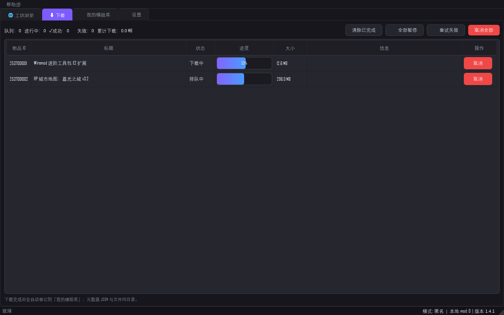
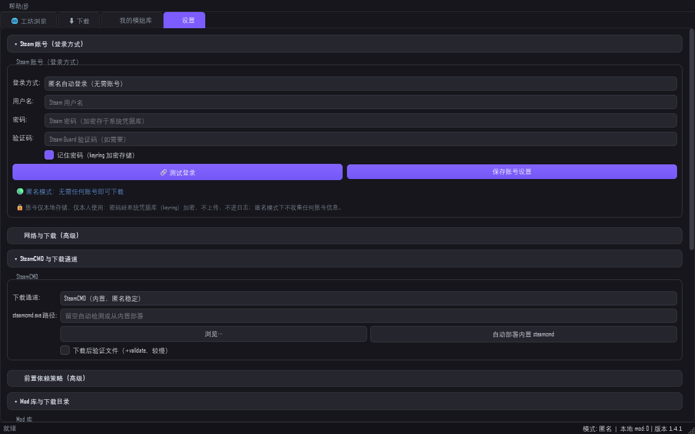

# SWDM — Steam 工坊下载管理器

[English](README.en.md) | [中文](README.md)


> 一套基于python的桌面程序：浏览/搜索 Steam 创意工坊、**无需 Steam 账号**匿名下载 mod、本地 mod 库分类管理。
> 由Atria-Dawn-Preview完成。

## 核心能力

| 需求 | 实现 |
|---|---|
| ① 指定游戏拉取工坊列表，分类/搜索/热度排名 | 游戏选择器（可收藏/自定义 AppID）→ `/workshop/browse/` 抓取 + `GetPublishedFileDetails` 批量补全元数据；支持关键词搜索、标签过滤、6 种排序（趋势/最新/订阅/评分/浏览/收藏），元数据补全后客户端重排保证"热度排名"准确；分页浏览 |
| ② 下载的 mod 便于分类/检索 | SQLite 本地库：按游戏/分类/标签/状态/关键词多维检索；mod 目录旁写 `swdm_meta.json` 元数据；批量启用/禁用、分类、删除、打开目录、导出当前筛选结果 |
| ③ 功能全面的 GUI | PySide6 五标签页：工坊浏览 / 下载队列（实时进度条） / 我的 mod 库 / 设置（高级） / 调试（实时日志流，默认隐藏）；系统托盘、单实例、全局崩溃日志 |
| ④ 无账号下载免验证 mod | 基于 SteamCMD `login anonymous` + `workshop_download_item`; 匿名失败时可切换手动登录（含 Steam Guard、keyring 加密存密码）。1.4.0 起：多 provider 链式自动回退（GGNetwork 匿名代理 → CDN 直链 → steamcmd 链尾兜底） |

## 多通道下载链（1.4.0）

每次下载都经过注册表构造的 provider 链：

```
用户首选通道 → 其余启用通道（按优先级） → steamcmd（terminal 链尾兜底）
```

- **一条链 = 一次尝试**：链内回退不消耗自动重试预算。
- 禁用 / 未配置（缺 key）/ 熔断冷却中（连续 3 次失败 → 60s 冷却）的通道自动跳过。
- 默认通道仍为 `steamcmd`，默认路径与 1.3.9 逐字节一致——不主动切换感知不到变化。
- **GGNetwork**（`api.ggntw.com`）是匿名第三方工坊代理：把工坊物品 URL 换成官方 CDN 直链，无需 key。试点性质：按 provider ToS 自律限速 20 次解析/分钟（令牌桶，突发 3）；限速只覆盖解析请求，不影响 CDN 传输速度。

## 功能速览

**浏览与搜索**
- 游戏选择器（可收藏 / 自定义 AppID，内置 59 个支持工坊的游戏）
- 关键词搜索 + 联想候选 + 标签精确过滤；6 种排序（趋势 / 最新 / 订阅 / 评分 / 浏览 / 收藏），元数据补全后客户端重排
- 分页浏览 + 下一页预取（低优先级，礼让用户点击）
- mod 详情弹窗：简介 / 评论 / 依赖树 / 预览图

**下载**
- 多 provider 链式自动回退（1.4.0）：GGNetwork 匿名代理 → CDN 直链 → steamcmd 链尾兜底
- 断点续传、取消、自动重试；速度采样滚动窗口（解决卡 99% 与速度突跳）
- 依赖自动下载（BFS 解析依赖树一并入队）；steamcmd 输出字节数为 0 时判定失败并清理残留
- 下载完成托盘通知；隐藏到托盘后也能真正退出（不留后台进程）

**mod 库管理**
- SQLite 本地库：按游戏 / 分类 / 标签 / 状态 / 关键词多维检索
- 批量启用 / 禁用、分类、删除（含文件）、打开目录、导出当前筛选结果
- mod 包导入导出；目录旁写 `swdm_meta.json` 元数据

**界面与系统集成**
- 深色 / 浅色主题；系统托盘 + 单实例 + 全局崩溃日志
- 调试 Tab 实时日志流（默认隐藏）；首次启动自动检测 / 一键部署 SteamCMD

## 界面预览

> 截图由 `tools/make_readme_shots.py` 用**固定夹具数据**离线渲染（不跑实网）。

| 工坊浏览 | 下载队列 |
|---|---|
|  |  |

| mod 库 | 设置 |
|---|---|
|  |  |

## 快速开始

```bash
pip install -r requirements.txt
python -m swdm.app        # 或 python swdm/app.py
```

首次启动自动检测系统已安装的 SteamCMD ；
若未安装可在「设置 → SteamCMD 引擎」一键部署（从官方 CDN 下载解压）。

## 技术架构

```
swdm/
├── app.py                     # 入口（main + 单实例 + 高 DPI）
├── core/                      # 核心层（GUI 无关，可独立测试）
│   ├── steam_api.py           # Web API 客户端（免 key 元数据/合集/浏览抓取/图片缓存）
│   ├── steamcmd_engine.py     # SteamCMD 子进程托管（匿名登录/进度解析/自动部署/登录测试）
│   ├── downloader.py          # 下载队列 + 调度 + 自动重试 + provider 链式回退 + 入库
│   ├── providers/             # 下载 provider 抽象层（1.4.0）
│   │   ├── base.py            # ABC DownloadProvider + ProviderMeta + http_download（断点续传/取消/429 上报）
│   │   ├── registry.py        # ProviderRegistry：链构造 / 熔断器 / UI 通道列表
│   │   ├── cdn.py             # CDN 直链通道（需登录态）
│   │   ├── steamcmd.py        # steamcmd 通道——链尾兜底
│   │   └── ggnetwork.py       # 匿名第三方代理通道（试点）
│   ├── mod_library.py         # SQLite mod 库（检索/分类/启用禁用/元数据旁车）
│   ├── auth.py                # 匿名 / 手动登录（keyring 加密）
│   ├── config.py              # 持久化配置（JSON，递归合并）
│   ├── games.py               # 内置 59 个支持工坊的游戏 + 自定义游戏
│   ├── logger.py              # 轮转文件日志 + 内存环形缓冲 + GUI 订阅
│   └── paths.py               # 数据目录（支持便携模式）
├── gui/                       # PySide6 界面
│   ├── main_window.py         # 主窗口/托盘/菜单/异常处理
│   ├── workshop_tab.py        # 浏览/搜索/下载卡片
│   ├── downloads_tab.py       # 进度队列与历史
│   ├── library_tab.py         # mod 库管理
│   ├── settings_tab.py        # 全部设置 + 登录
│   ├── debug_tab.py           # 实时日志（默认隐藏）
│   ├── detail_dialog.py       # mod 详情弹窗（简介/评论/依赖/预览图）
│   ├── workers.py             # QThread/QThreadPool 桥接核心回调
│   ├── services.py            # 服务容器
│   └── styles.py              # 深色/浅色主题
└── resources/icon.ico
```

每个文件的职责与迭代溯源见 [docs/project_structure.md](docs/project_structure.md)。

## 数据目录

- Windows：`%APPDATA%\SWDM\`（config.json、logs/、library.db、cache/、mods/、steamcmd/）
- 便携模式：项目根目录放 `portable.marker` 文件，数据改存 `<根>/data/`

## 已知限制

- 匿名下载仅支持"工坊内容不需要游戏所有权验证"的游戏（如 GMod）。**受限 App（如 DayZ 221100）的工坊物品需要拥有该游戏的 Steam 账号**——这是 Valve 的设计而非缺陷，匿名会话拿不到带签名的 CDN 直链。
- 工坊浏览页分类标签由 API 返回的 `tags` 字段提供客户端过滤；服务端标签筛选依赖 `requiredtags[]` 参数。
- 首次使用时 SteamCMD 可能需更新自身，耗时较长。
- GGNetwork 通道仅经过离线 mock 验证，未做过实网端到端验证（1.4.1 计划补测）。它从不在默认路径上——必须显式选择才会使用。
- 集合（Collection）批量下载、界面图标体系、缩略图磁盘缓存排在 1.4.2。

## 开发

- 提交规范与双语文档政策（含中英文注释规范）：[docs/git_workflow.md](docs/git_workflow.md)
- 完整变更历史：[docs/changelog_1.3.8.md](docs/changelog_1.3.8.md) → [1.3.9](docs/changelog_1.3.9.md) → [1.4.0](docs/changelog_1.4.0.md)
- 测试：`tests/run_all.ps1`（offscreen Qt，约 59 脚本；本机运行需 `PYTHONUTF8=1`）

## 1.4.1 路线（开发中）

- 源码注释与 docstring 中英文适配（t30）：`swdm/` 全部模块 docstring 英化 + 公共 API docstring 补齐，已完成
- GGNetwork 实网端到端补测（真实网络环境一方）
- ~~`cdn_downloader.py` 兼容门面移除（新代码改用 `swdm.core.providers.cdn`）~~ — 已完成（t40，三个测试迁至 CDNProvider 直连）
- 下载页批量暂停/继续等 polish 项

## 许可证

见 [LICENSE](LICENSE)。
